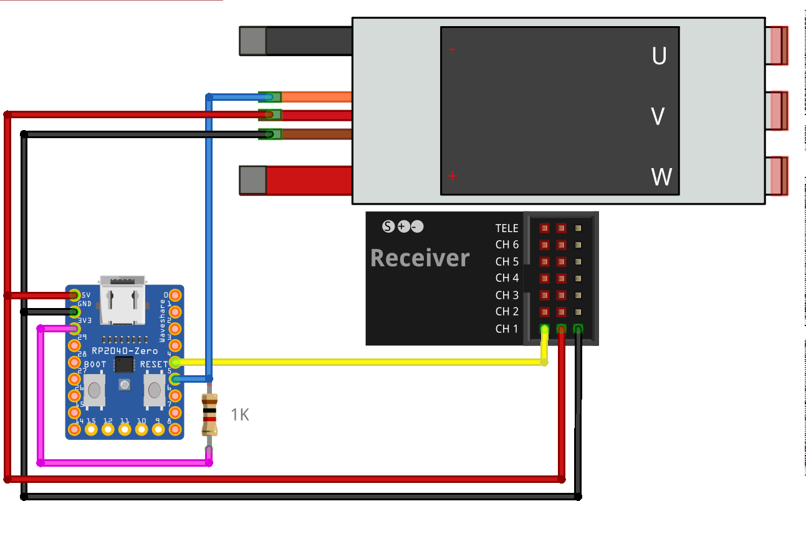

## Castle Link library for RP2040 using PIO

Library for the Castle Link protocol for RP2040 using PIO. It is compatible with the [SDK](https://raspberrypi.github.io/pico-sdk-doxygen/) and [Arduino](https://github.com/earlephilhower/arduino-pico).

How to use it:

- With SDK. Add *castle_link.pio, castle_link.h and castle_link.c,* to your project. Modify CMakeLists.txt. Add *pico_generate_pio_header* and the required libraries (pico_stdlib, hardware_irq, hardware_pio). See [CMakeLists.txt](sdk/CMakeLists.txt)
- With Arduino. Add *castle_link.pio.h, castle_link.h and castle_link.c* to your project.
- Define the handler which receives the telemetry frames.
- Change CASTLE_LINK_IRQ_NUM if conflicts with other state machines irqs. Valid values 0 to 3.  

See [main.c](sdk/main.c) with code example.  

Circuit:

- Connect receiver throttle to pin_base (gpio).
- Connect esc signal to pin_base + 1. Esc signal with pull up, 1k - 6k. See Castle Link protocol to adjust resistance value.
- Power voltage at 5V between 3V and 5.5V.
- **Always** disconnect battery before plugin USB.

 
  <i>Circuit</i>  

\
Functions:  
\
**uint castle_link_init(PIO pio, uint pin_base, irq)**  

Parameters:  
&nbsp;&nbsp;**pio** - load the castle protocol at pio0 or pio1  
&nbsp;&nbsp;**pin_base** - set pins. pin = receiver signal. pin + 1 = esc signal  
&nbsp;&nbsp;**irq** - select the pio irq. Valid values for pio0: PIO0_IRQ_0, PIO0_IRQ_1 and for pio1: PIO1_IRQ_0, PIO1_IRQ_1. Useful if other states machines are also using irqs.  

Returns:  
&nbsp;&nbsp;State machine used  
\
**void castle_link_set_handler(castle_link_handler_t handler)**  

Parameters:  
&nbsp;&nbsp;**handler** - function to handle the telemetry frames  

Handler function:  
\
**void castle_link_remove()**  

Reset handler and removes pio program from memory.  
\
**void castle_link_handler(castle_link_telemetry_t frame)**  

Parameters received:  
&nbsp;&nbsp;**frame** - telemetry frame  
\
Telemetry frame:  

*typedef struct castle_link_telemetry_t {  
    float voltage;  
    float ripple_voltage;  
    float current;  
    float thr;  
    float output;  
    float rpm;  
    float voltage_bec;  
    float current_bec;  
    float temperature;  
    bool is_temp_ntc;  
}*  

